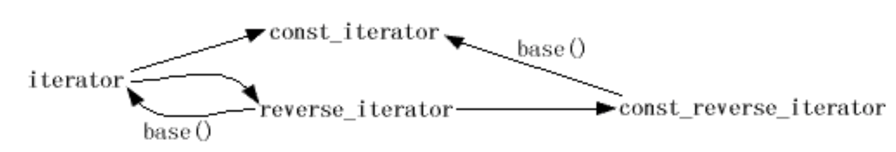
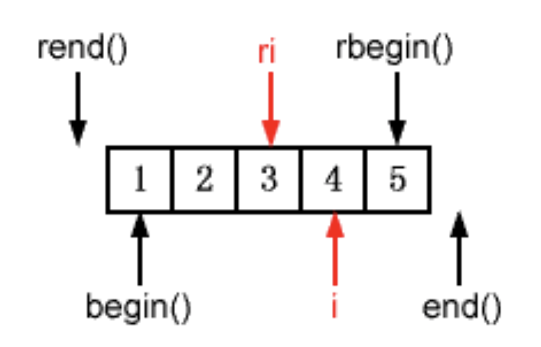
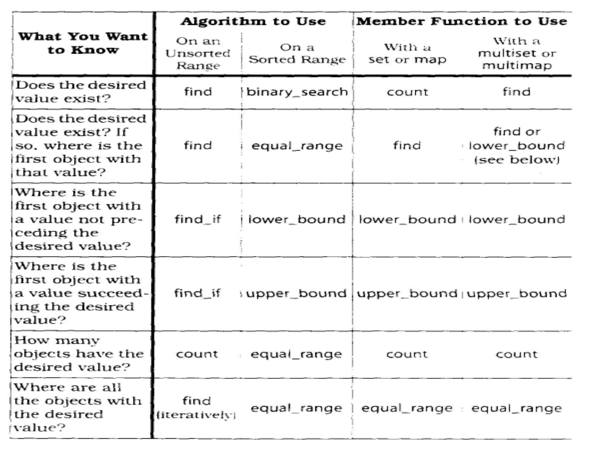

# Tips from Book _Effective STL_ by **Scott Meyers**
---

# Containers: 
## Item 1: Choose your containers with care

There are two ways to classify containers, by semantics or by implementations. 

By Semantics: 
* Standard Sequential: _vector_, _string_, _deque_, _list_
* Standard Associative: _map_, _set_, _multi_map_, _multi_set_
* Non-standard Sequential: _rope_, _slist_
* Non-standard Associative: _hash_set_, _hash_multiset_, _hash_map_, _hash_multimap_

By Implementations:
* Node-based: _map_, _set_, _multi_map_, _multi_set_, _list_
* Memory-based: _vector_, _string_, _deque_

## Item 2: Beware the illusion of container-independent code

Avoid to templatize a container

## Item 3: Make Copying Cheap and Correct for Objects in Containers.

## Item 4: Call Empty() instead of Checking size() against zero

_Empty()_ is O(1) complexity, while _size()_ is O(n). 

## Item 5: Prefer Range Member Functions to their single-element counterparts

Avoid using _push_back()_, _push_front()_ and other single-element counterparts in a LOOP

Learn to use the following functions to modify containers with iterator ranges
- Construction: container::container(InputIterator begin, InputIterator end);
- Insertion: 
  - Sequential container::insert(OutputIterator position, InputIterator begin, InputIterator end);
  - Associative container::insert(InputIterator begin, InputIterator end);
- Erasing: container::erase(Iterator begin, Iterator end);
- Assignment: container:assign(Iterator begin, Iterator end);

## Item 6: Be alert for C++'s most vexing parse

## Item 7: When Using Containers of Newed Pointers, Remember to Delete the Pointers Before the Container is Destroyed.

## Item 8: Never Create Containers of auto_ptrs.
*Obsolete*: _auto_ptr_ is deprecated since c11. 

## Item 9: Choose Carefully Among Erasing Options.

To remove all certain elements:
* For _vector_, _deque_, _string_: ```c.erase(std::remove(c.begin(), c.end(), badValue), c.end());```
* For _list_: ```c.remove(BadVlaue);```
* For associative containers: ```c.erase()```

To remove all elements with a certain condition
* For _vector_, _deque_, _string_: ```c.erase(std::remove_if(c.begin(), c.end(), badValue), c.end());```
* For _list_: ```c.remove_if(BadVlaue);```
* For associative containers: 
```cpp
for it in container c:
  if (cond): 
    it = c.erase(it++);
  else:
    it++;
```

## Item 10: Be Aware of Allocator Conventions and Restrictions.

## Item 11: Understand the Legitimate Uses of Custom Allocators.

## Item 12: Have Realistic Expectations about the Thread Safety of STL Containers.

* Multi-threads on reading a single container
* Single thread on work on a single container

# Vector and String
## Item 13: Prefer Vector and String to Dynamically Allocated Arrays

## Item 14: Use reverve to avoid Unnecessary Reallocation

Understand the difference of _size()_, _capacity()_, _resize()_ and _reserve()_.

## Item 15: Be aware of Variations in String Implementations

## Item 16: Know how to pass vector and string data to legacy APIs

## Item 17: Use Swap Trick to trim Access Capacity
For a _vector_ that used to be large, use the following trick to reduce its capacity.
```cpp
vector<Widget> ws;
// Operations to increase ws and then decrease
vector<Widget>(ws).swap(ws); // Construct a temporal vector using the existing vector and swap
```

## Item 18: Avoid using vector\<bool\>
vector\<bool\> is instantiated to be represented by a proxy class. The following code is thus invalid and fails to compile. However, using _deque\<bool\>_ is valid. Or, consider to use _bitset_. 
```cpp
vector<bool> bs{false};
bool* b = &bs[0];
```

# Assocative Containers: 
## Item 19: Understand the difference between Equality and Equivalence.
Two elements are: 
* of equality iff ```a.operator==(b)```
* of equavalence iff ```!a.operator<(b) && !b.operator<(a)```

Associative containers use equivalence comparison for checking duplicates. 

## Item 20: Specify Comparison Types for Associative Containers of Pointers.

## Item 21: Always have comparison functions Return False for Equal values.
Always use strict ordering (<) rather than equal ordering (<=)

## Item 22: Avoid in-place Key Modification in set and multi_set.
Never change elements in _set_ or _multi_set_. Elements in _map_ or _multi_map_ can change but should be avoided. 

To modify a element in _set_ or _map_, shall copy the element out first, do the modification and then do the insertion. 

## Item 23: Consider Replacing Associative Containers with Sorted Vectors
This is compatible for workload with less update and more query. This technique can effectively reduce the memory and increase the locality. 

## Item24: Choose carefully between map::operator[] and map-insert when Efficiency is Important.
* Use _insert()_ for first time insertion, as _operator[]_ will construct a temporal element with default constructor so that assignment can take place upon. 
* Use _operator()_ for update.
* Recommended practice: 
```cpp
template<typename MapType, typename KeyArgType, typename ValueArgType>
typename MapType::iterator AddOrUpdate(MapType& m, KeyArgType& k,
                                       ValueArgType& v) {
  typename MapType::iterator lb = m.lower_bound(k);
  if (lb != m.end() && !m.key_comp()(k, lb->first)) {
    lb->second = v;
    return lb;
  } else {
    using MVT = typename MapType::value_type;
    return m.insert(lb, MVT(k, v));
  } // end if
}
```

## Item 25. Familiarize yourself with the Nonstandard Hashed Containers.

# Iterators
## Item 26: Prefer iterator to const iterator, reverse_iterator, and const_reverse_iterator.
This is because most APIs only accept iterators as parameters. Understand the following conversion rules between several iterators 


## Item 27: Use distance and advance to convert a container's const_iterators to iterators.
```cpp
const_iterator ci;
iterator i;
advance(i, distance<const_iterator>(i, ci));
```

## Item 28: Understand how to use a reverse_iterator's base iterator.
A reverse_iterator.base() has one offset with its own, depicted as below: 


The offset has no side effects for insertion and should be taken account for deletion.
```cpp
Container c;
Reverse_Iterator ri;
c.insert(ri.base(), value);  // No offset for insertion
c.erase((++ri).base()); // An offset for removal
```

## Item 29: Consider istreambuf_iterators for character-by-character input
A recommended way to read all chars from a file: 
```cpp
ifstream inputFile("interestingData.txt");
string fileData((istreambuf_iterator<char>(inputFile)), istreambuf_iterator<char>());
```

# Algorithms
## Item 30: Make sure destination ranges are big enough.
Functions in algorithm will not allocate space. Either reserve enough space before applying the function or use inserter instead. 
```cpp
transform(a.begin(), a.end(), b.end(), func);  // invalid
transform(a.begin(), a.end(), back_inserter(b), func);  // invalid
```

*NOTE*: _front_inserter_ will use _push_front()_  and _back_inserter_ will use _push_back()_. 

## Item 31: Know your sorting options.
Understand the function and usage of _sort_, _stable_sort_, _partial_sort_, _partition, stable_partition_ and _nth_element_.

## Item 32. Follow remove-like algorithms by erase if you really want to remove something.
Understand the function and usage of _remove()_, which essential move all valid elements forward and keep the original number of elements. To really remove all invalid elements, use the following tricks:
```cpp
c.erase(remove(c.begin(), c.end(), badValue), c.end());
``` 

## Item 34: Note which algorithms expect sorted ranges.
The following functions are only valid for sorted ranges: _binary_search_, _upper_bound_, _set_union_, _set_difference_, _merge_, _includes_, _lower_bound_, _equal_range_, _set_intersection_, _set_symmetric_difference_, _inplace_merge_, _unique_ and _unique_copy_. 

## Item 35: Implement simple case-insensitive string comparisons via mismatch or lexicographical compare.
Understand the function and usage of _mismatch_ and _lexicographically_compare_

## Item 36: Understand the proper implementation of copy_if.
Understand the usage and function of _copy_, _replace_copy_, _replace_copy_if_, _remove_copy_, _remove_copy_if_, _copy_backward_, _reverse_copy_, _unique_copy_, _rotate_copy_, _partial_sort_copy_ and _unintialized_copy_.

The correct trivial implementation of _copy_if_:
```cpp
template< 
typename Inputlterator, // a correct
typename Outputlterator, // implementation of 
typename Predicate> //copy_if
Outputlterator copy_if( Inputlterator begin,
    Inputlterator end, Outputlterator destBegin, Predicate p) {
  while (begin != end) {
    if (p(*begin)) *destBegin++ = *begin;
    ++begin; 
  }
    return destBegin; 
}
```

## Item 37: Use accumulate or for_each to summarize ranges.
Understand the function and usage of _accumulate_, _inner_product, _adjacent_difference_ and _partial_sum_.

# Functors, Functor Classes, Functions, etc.
## Item 38: Design functor classes for pass-by-value.
Make functor classes inexpensive to copy and avoid polymorphsim.

## Item 39: Make predicates pure functions.
Predicate functions shall be pure functions which depend only on input, NOT state. Shall make it const. 

## Item 40. Make functor classes adaptable.
Make functor classes inherit from correct instantiation of _unary_function_ and _binary_function_. In this way, these functor classes can be adapted for _not1_ and other functions to use. 

 **NOTE**: _unary_function_ and _binary_function_ are depreciated since C++11. Should directly use lambda expression or _std::function_ instead. 

## Item 41: Understand the reasons for ptr_fun, mem_fun, and mem_fun_ref.
* _ptr_fun_ transfer a function pointer to a functor. 
* _mem_fun_ transfer a member function pointer to a functor that accepts its object as a pointer
* _mem_fun_ref_ transfer a function pointer to a functor that accepts its object as a reference. 

## Item 42: Make sure less<T> means operator<
The std template less<T> can be instantiated to override the default rule to order elements in associated containers. Not to confuse other programmers, use strict less ordering (<) inside for comparison. 
```cpp
template<> //This is a specialization of std::less for Widget;
struct std::less<Widget>: 
public std::binary_function< Widget, Widget, bool> {
  bool operator()(const Widget& lhs, const Widget& rhs) const {
    // return lhs.maxSpeed() < rhs.maxSpeed(); //it's a very bad idea 
    return lhs < rhs; // Should be this to not surprise others. 
  } 
};
```

# Programming with STL
## Item 43: Prefer algorithm calls to hand-written loops.
There are three reasons:
* Efficiency: Algorithms are often more efficient than the loops programmers produce.
* Correctness: Writing loops is more subject to errors than is calling algorithms.
* Maintainability: Algorithm calls often yield code that is clearer and more straightforward than the corresponding explicit loops.

## Item 44: Prefer member functions to algorithms with the same names
* Reason: Member functions are optimized with respect to its containers. 

## Item 45: Distinguish among count, find, binary search, lower_bound, upper_bound, and equal_range.
Refer to the following table for correct ways to find an element: 


## Item 46: Consider function objects instead of functions as algorithm parameters.
Pass functor instead of function pointer into algorithm functions with the following reason.
* The inline declaration of _operator()_ of functor allows for better efficiency. 

## Item 47: Avoid producing write-only code.
Pay attention to code readbility and maintainability. 

## Item 48: Always #include the proper headers.

## Item 49: Learn to decipher STL-related compiler diagnostics.

## Item 50: Familiarize yourself with STL-related web sites.
[back](./)
